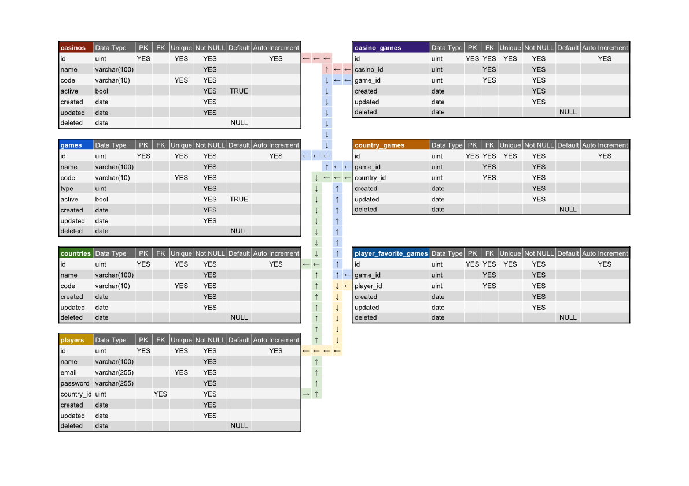

# Bet Gaming

### Description

_Fictive project created for testing purposes only!_
This project was bootstrapped with [Create React App](https://github.com/facebookincubator/create-react-app).

I choose CRA because it's a consolidated boilerplate with a lot of ready made configs and optimizations for webpack, babel, the development and the build process at all.

I'm using the generated project to work on the two edges:

- **Front** (in ./src and ./public folders);
- **Back** (in ./back_src folder with server.js as entrypoint);

---

### Questions

1. Write a function that connects to https://restcountries.eu/ and gets a unique country from a
   specific name given using the Node back end and send it to the front end.

-- the backend function is **[back_src/controllers/CountryController.getByName](https://github.com/mjr-repos/bet-gaming/blob/master/back_src/controllers/CountryController.js#L7)** and **getByCode**;
-- I writed the flow from front (redux) to back (express);
-- the redux flow files are in **[src/domains/country/actions](https://github.com/mjr-repos/bet-gaming/blob/master/src/domains/country/actions)**: **fetchCountryByName** and **fetchCountryByCode**;
-- it uses the fetchMiddleware to dispatch calls to backend;

2. Using the same API [https://restcountries.eu](https://restcountries.eu), and from an array of string, write a function
   that returns a list of countries where their name matches at least a part of one of these string
   use the Node back end and send it to the front end.

-- the backend function is **[back_src/controllers/CountryController.getByNames](https://github.com/mjr-repos/bet-gaming/blob/master/back_src/controllers/CountryController.js#L18)**;
-- it receive an array in url first;second;third, url: /api/countries/by-names/brazil;malta;
-- in front it uses the same api in component **[src/domains/country/CountrySelect](https://github.com/mjr-repos/bet-gaming/blob/master/src/domains/country/CountrySelect.js)**;
-- in the country table, the same way of search, by ; character, are enabled;
-- the country table search match against code, name, region and subregion;

3. Using the same API [https://restcountries.eu](https://restcountries.eu) in the React front end list all the countries
   and a field to filter the country by name.

-- the backend function is **[back_src/controllers/CountryController.getAllAndReturn](https://github.com/mjr-repos/bet-gaming/blob/master/back_src/controllers/CountryController.js#L49)**;
-- the front flow starts in **[src/domains/country/CountriesTable](https://github.com/mjr-repos/bet-gaming/blob/master/src/domains/country/CountriesTable.js)**;
-- the front filter does not dispatch a server call;

4. Using the Slot Machine data, create a function that, when it’s called by the front end, gives back the
   result of a spin and show the result.

-- the slot machine component is **[src/domains/game/SlotMachineCard](https://github.com/mjr-repos/bet-gaming/blob/master/src/domains/game/SlotMachineCard.js)**;
-- the three reels are **[src/domains/game/SlotMachineReel](https://github.com/mjr-repos/bet-gaming/blob/master/src/domains/game/SlotMachineReel.js)**;
-- some logic is in Card, some in Reel;
-- all the feature of slot machine are front only, because there are no persistence in backend;
-- the functions of slot machine rules are all tested;

SQL questons:

1. Send the image of the schema and also the sql to create the database and tables.

-- the detailed schema shared in a Google Sheet: [https://docs.google.com/spreadsheets/d/1nZC-hvMTx2gXVU9dggUY1z40ilIPhALIQ-ocA9TWe-0/edit?usp=sharing](https://docs.google.com/spreadsheets/d/1nZC-hvMTx2gXVU9dggUY1z40ilIPhALIQ-ocA9TWe-0/edit?usp=sharing)
-- the creation sql is **[back_src/database/createQuery.sql](https://github.com/mjr-repos/bet-gaming/blob/master/back_src/database/createQuery.sql)**;

2. Write based on above, a SQL query to get all players that have games of type "SLOT" as their favorite games.

-- the query file is **[back_src/database/selectQuery.sql](https://github.com/mjr-repos/bet-gaming/blob/master/back_src/database/selectQuery.sql)**;

---

### Development & Testing

- Start the servers using the **"npm start-dev"** or **"yarn start-dev"**:
  -- front run into **[localhost:3000](http://localhost:3000)**;
  -- back run into **[localhost:4000](http://localhost:4000)**;

In development, I use npm-run-all to start both servers (a back/express server and a front/webpack-dev-server from CRA).

The sass layer is builded using node-sass-chokidar, and all .sass files turns into .css files that can be imported into components.

-- There are some tests of module SlotMachineRules, to run all tests simply use the **npm test** or **yarn test** command;

_The CRA project does not use CSS Modules or CSS-in-JS approach, only the .css import into .js files facility._

---

### Build & Deploy

When we build with "npm/yarn build" command, a build folder is generated.
In production, we only use the ./back_src, ./build and ./server.js files (plus .env and pkg.json).

The integration has configured in heroku, and the link is:
[https://bet-gaming.herokuapp.com](https://bet-gaming.herokuapp.com/)

---

### FRONT:

##### Code Standard

- I'm using prettier to format the code in a pre-commit hook;
- The front code is structured as:
  -- **index.js** (as entrypoint file);
  -- **App** (entrypoint component);
  -- **styles** (general style .sass files);
  -- **configs** (common config to use across the system);
  -- **domains** (domain driven folder to create components);
  -- **middlewares** (folder to store redux middlewares like fetch, logger, analytics);
  -- **modules** (vanilla modules, pure js, to use freely in components, backend, and easy testable);

The Domain folder contains all components separated by application higher domains and/or features, and each domain can have:

- **Selectors** (reselect files to write performatic memoized functions);
- **Constants** (specific constants of domain);
- **Components/Containers** (dumb and smart at same file, better to read/code);
- **Styles** (specific styles with same name as component);
- **Reducer and Actions** (single file action/reducer approach, better to code entire flow of redux without need to navigate);

### BACK:

##### Code Standard

- Prettier to code format too;
- The back code is structured as:
  -- **server.js** (as entrypoint file);
  -- **./back_src/configs** (simple and unique configurations folder);
  -- **./back_src/controllers** (controllers of a MVC structure as ES6 classes);
  -- **./back_src/services** (layer to store ES6 classes with common/shared funcionalities);

---

### FRONT:

##### Some libraries used in project

- Redux (State Management);
- React Router (Routing System);
- Reselect (Memoization);
- Bootstrap 4 (With Sass);
- Reactstrap (React Components for Bootstrap 4);
- Font Awesome 5 (Icon Library);
- Axios (fetch library);

### BACK:

##### Some libraries used in project

- Express (Web HTTP Framework);
- Axios too;
